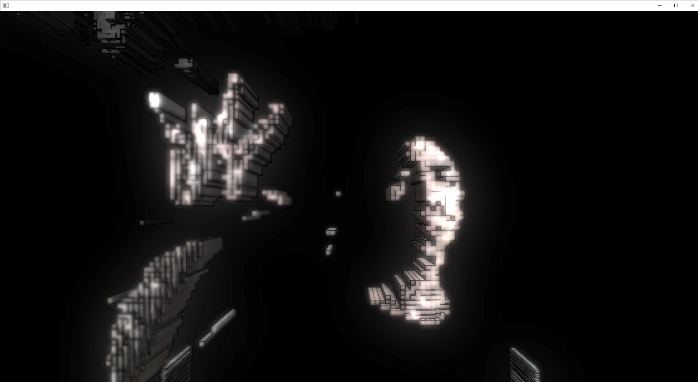
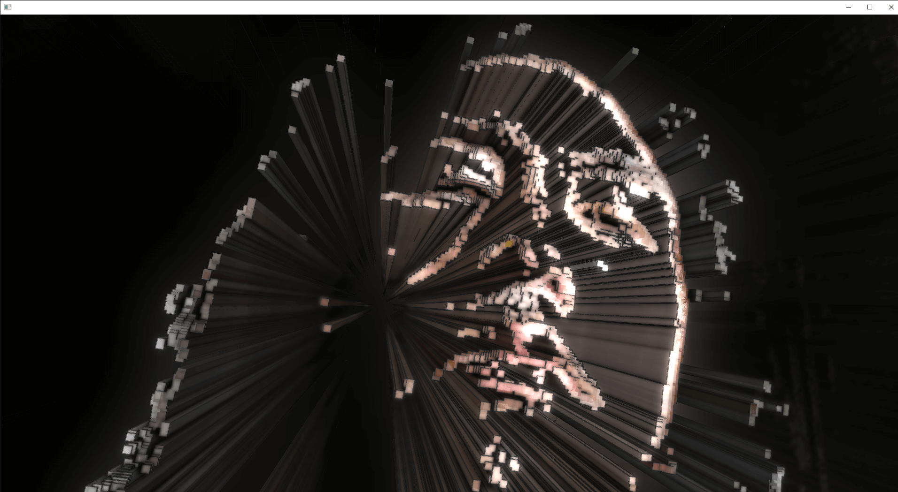

# Filter Instancing Example

This project is just for a study of Atomic Counter Buffer + Indirect rendering using RealSense.
See the article of this repo.

## Dependency

* Hardware
    * realsense
* Addon
    * [ofxDeferredShading]()
    * [ofxDeferredHelper]()
    * [ofxRealSenseUtil]()

## Screenshots

Brigthness Filter

Sobel Filter

